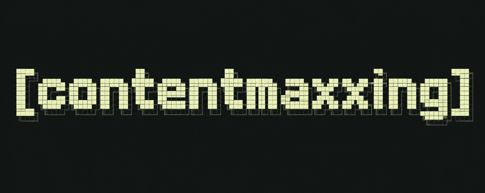

# Your work is the starting point.

**How would you like to build your content engine?**

**1. Curated interview**

A few focused questions at a time. Find your audience, your point of view,
your voice, and the work worth sharing.

**2. Mega file dump**

Bring transcripts, notes, old posts, articles, and profile material. I'll
organize the files, propose what they tell us about you, and ask about the gaps.

You can combine both paths. Your progress stays in your creator folder.

---

Agent instructions: include a visible HUD in the welcome reply. Render the image
above if the host can display it to the creator. Reading it with an inspection
tool does not put it in the reply. Otherwise run `contentmaxxing welcome` and
copy its banner into a fenced text block. If the creator cannot see the image after one attempt, switch
immediately to the text HUD. Never repeatedly send the same broken link or
regenerate branding just to deliver an onboarding screen. Present the two choices as normal chat choices the
creator can answer. Do not require another application or open a browser merely
to onboard. Run `start` and follow its saved phase. Returning creators continue
their existing setup without repeating this introduction.

Files accepted directly: UTF-8 TXT, Markdown, CSV, JSON/JSONL, SRT and VTT.
For PDF, DOCX, screenshots, audio and video, obtain text extraction/transcription
through the host's available tools or ask for an export. Report these files as
pending conversion; never claim their contents were read without extraction.
